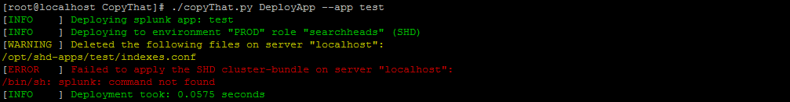

# CopyThat
Manages Splunk Search-Head Clusters, Indexer Clusters and Universal Forwarder Managment Servers with a simple YAML configuration and powerful logging (=python's logging framework).

Help of DeployApp command:

DeployApp command in action:

DeployApp command in action with verbose output:

